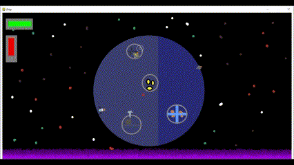

# The First Line
A game I will make for english

## The Vision
You control a ship in a 2d environment destroying enemys who harm your home planet. 

This game will have a story and maybe a ending if not dev lazy. 

## Current Progress
1. I have figured out the controls for the ship!! You move forward and backward with w/s and turn left/right with a/d.
2. I added a enemy that follows you.  
3. I added Lazers and a Lazer heat value
4. I made the lazers aim with your mouse (You can kill enemies now)
5. I added 3 new enemies (One shoots, one heals, one turns invisible) and a new map!
6. Added Wave based Enemies and a wave timer
7. Added Polish and itch.io link

## Things that will be added

- Different types of Lazers to shoot with
- A story 
- Maybe boss 
- Tutorial 

## Excepted Release date
The game is Released but is a ~~piece of shi~~ a work in progress

## How to run code
Download the shipGame folder, and  find the ship.py file and run it. You may have to download python & pygame.

I created an itch.io link https://luke-beekham.itch.io/the-first-line

## Credits
1. All made my Me *Luke Beekham*
2. Although *Mr.Heisel* created the project for english 
3. And [DaFuffyPotato](https://www.youtube.com/@DaFluffyPotato) for making this project possible!

## Tools
- **FigJam** for designing
- **Bosca Ceoil** for music
- **LabChrip** for sounds
- **Libresprite** for art
- **Visual Studio Code** for my code editor